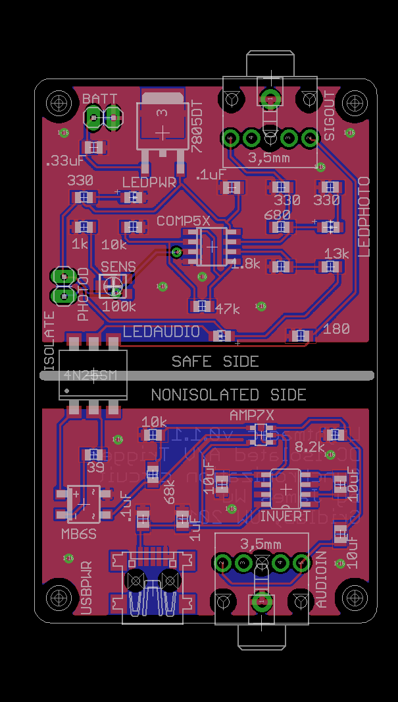

# Lightmagic
A safety-isolated dual-channel flexible audio and photodiode trigger for electrophysiological recording time synchronization and verification

## Design
The board has 2 inputs: a mono audio trigger (3.5mm / 1/8" jack, stereo combined) and a photodiode.

The photodiode is generally mounted to a screen or other photo synchronization trigger, and its sensitivity is adjustable with a trim pot. It's powered by a single regulated >5V low voltage source, usually a 9V battery. The audio jack is plugged into an audio synchronization trigger, and looks for any (3Hz highpassed) audio input higher than 0.7V. The audio half is powered by a mini-USB cable which may be hooked up to wall AC at some point, and the entire audio input is optically isolated from the photo trigger half of the board.

The output is an additional 3.5mm (1/8") audio jack with the L channel (tip) carrying the (rectified, amplified, isolated) audio trigger signal and the R channel (ring) carrying the (amplified) photodiode signal. Both channel should swing from 0 (off) - 2V (trigger on) with the standard BOM items.

The design allows for this board to be "trigger glue" between a psychophysical presentation (audio or on-screen stimuli) and electrophysiological recording systems when sub-millisecond synchronization is required, such as for neurostimulation. Note that output voltages are still in the 2V range; this should be further reduced as close as possible to the recording system via passive voltage dividers down to safe voltages and currents (hopefully <50μA for all failure conditions) for in-vivo recordings.

## Files

The source Eagle CAD files are in the `eagle` directory.
The OSH Park-compatible `ger` and `xln` files can be found in the `gerber` directory. Zipping it will allow for manufacture.
